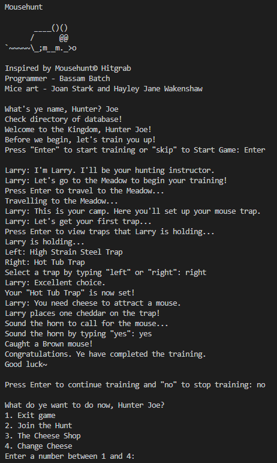
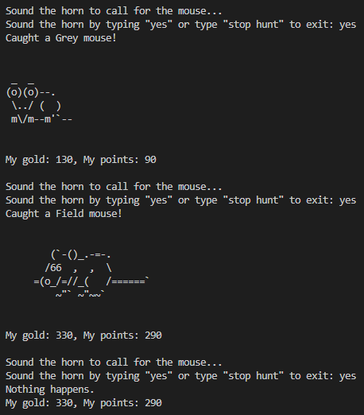

# Mouse Hunt

**A text-based mouse hunting game inspired by Mousehunt&copy; Hitgrab.**

## Overview

Mouse Hunt is a text-based hunting game built entirely from scratch in Python. Set in a medieval kingdom, you play as a hunter who sets traps, baits them with cheese, and sounds the horn to catch mice - each rendered with original ASCII art. The game features a training mode, a shop system, multiple trap and cheese types, and a gold and points economy.

## Getting Started

Before you join the hunt:
1. Complete the training - it grants a one-time trap enchantment based on your chosen cheese
2. Buy cheese from the Cheese Shop (Option 3)
3. Attach cheese to your trap (Option 4 - Change Cheese)
4. Join the hunt and sound the horn!

## Features
* **Training mode** - guided by Larry the instructor, teaches trap setup and hunting mechanics
* **One-time enchantment** - completing training grants a bonus based on cheese choice:
  * Cheddar → +25 points from next Brown mouse
  * Marble → +25 gold from next Brown mouse
  * Swiss → +0.25 attraction to Tiny mouse
* **Trap types** - Cardboard and Hook Trap, High Strain Steel Trap, Hot Tub Trap
* **Cheese types** - Cheddar, Marble, Swiss
* **Mouse types** - Brown, Field, Grey, White, and Tiny
* **Gold and points economy** - earn rewards from successful catches
* **Kids-friendly name filter** - screens inappropriate hunter names on signup
* **ASCII art** - original mouse art throughout the game

## Tech Stack
* Python 3

## How To Run

```bash
python3 game_final.py
```

## Preview



<table>
  <tr>
    <td></td>
    <td></td>
  </tr>
</table>
